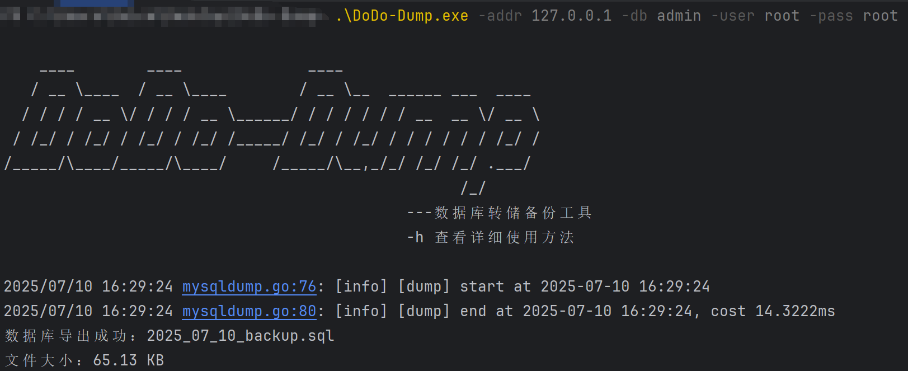

# DoDo-Dump


---

## 项目简介

**DoDo-Dump** 是一个轻量级、高效的数据库备份工具，专注于将数据库导出为 SQL 文件，并支持直接上传备份文件至阿里云 OSS 存储桶，满足日常备份、迁移及自动化运维的需求。

---

## 主要功能

- ✅ 支持将数据库结构和数据完整导出为 `.sql` 文件  
- ✅ 支持 MySQL 数据库（未来计划支持更多数据库）  
- ✅ 支持通过命令行参数配置，实现自动化备份  
- ✅ 支持上传备份文件到阿里云 OSS 存储桶  

---

## 安装与运行环境

- 支持Linux、Windows 平台


## 使用方法

### 一、查看用法:

```
DoDo-Dump.exe -h

    ____        ____              ____
   / __ \____  / __ \____        / __ \__  ______ ___  ____
  / / / / __ \/ / / / __ \______/ / / / / / / __  __ \/ __ \
 / /_/ / /_/ / /_/ / /_/ /_____/ /_/ / /_/ / / / / / / /_/ /
/_____/\____/_____/\____/     /_____/\__,_/_/ /_/ /_/ .___/
                                                   /_/
                                             ---数据库转储备份工具
                                             -h 查看详细使用方法

Usage of DoDo-Dump.exe:
  -addr string
        数据库地址 (default "localhost")
  -db string
        数据库名
  -oss-ak string
        OSS AccessKey ID
  -oss-bucket string
        OSS Bucket 名称
  -oss-endpoint string
        OSS Endpoint
  -oss-sk string
        OSS AccessKey Secret
  -output string
        输出文件名 (default "2025_07_10_backup.sql")
  -pass string
        数据库密码
  -port string
        数据库端口 (default "3306")
  -up
        是否上传至 OSS
  -user string
        数据库用户名
```

### 二、只备份不上传:

```
DoDo-Dump.exe -addr 127.0.0.1 -db admin -user root -pass root
```




### 三、备份并上传:

```
DoDo-Dump.exe -addr 127.0.0.1 -db admin -user root -pass root -up -oss-endpoint XXX -oss-ak XXX -oss-sk XXX -oss-bucket XXX
```


# 免责声明

**DoDo-Dump** 是一个开源的数据库备份工具，旨在为开发者和运维人员提供简单便捷的数据库导出与备份上传功能。在使用本工具之前，请务必阅读以下免责声明：

1. **风险自负**
    本工具“按原样”提供，不附带任何明示或暗示的担保，包括但不限于适销性、特定用途适用性或无侵权的保证。用户在使用过程中所造成的任何直接或间接损失（如数据丢失、服务中断、备份失败等），**作者不承担任何责任**。
2. **数据安全**
    本工具不会对数据库数据进行加密处理。请确保您使用的是可信的网络环境，且不要将敏感信息（如数据库密码、OSS 密钥）暴露在公开场合或日志中。
3. **使用 OSS 上传功能时的注意事项**
    请妥善保管您的 OSS AccessKey 与 SecretKey，**建议使用具有最小权限的子账户访问凭证**，避免因泄露导致云存储资源被滥用。
